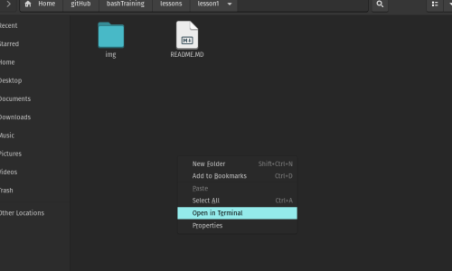

__Lesson 1: Shortcuts__
=======================

By: _Jstith_


### Objective

- Learn keyboard shortcuts for the terminal
- Practice using keyboard shortcuts for the terminal

### References

- [The Linux Command Line](https://nostarch.com/tlcl2) by No Starch Press
- [Keyboard Shortcuts for Bash](https://www.howtogeek.com/howto/ubuntu/keyboard-shortcuts-for-bash-command-shell-for-ubuntu-debian-suse-redhat-linux-etc/) by How-To Geek

### Introduction

By now, we're all familiar to at least some degree with using the terminal. Most everybody knows you can use `ctl-alt-t` to launch the terminal (or `super-t` on some distros), and you may know that you can right click in any directory from the file explorer and click open in terminal to open a terminal in that directory as well.



This lesson will instead focus on keyboard shortcuts to make typing in the terminal more efficient. Do not confuse this with [typing faster](https://www.nitrotype.com/). That is a separate skill that can also be refined to improve your general computing ability. These shortcuts focus on moving the cursor around and quickly adding, deleting, and cutting/pasting text from the terminal. Being comfortable with these hotkeys will help you enter commands, correct mistakes, and navigate the terminal faster. These hotkeys work when typing STDIN, but not always in text editors such as vim or nano.

### Cursor Movement

The first set of commands focus on moving the cursor around. It is worth noting that the *cursor* is not the icon your mouse controls. That is the *pointer*. The *cursor* is the blinking indicator that shows where text input from a keyboard goes. Generally, Linux users, hackers, and the like try to use the cursor as much as possible and the pointer as little as possible. Why? Because you only have access to a pointer on your host machine. We frequently connect to other machines using a shell, think SSH or FTP. There, you don't have a pointer to use, and if you don't know how to do something from the command line (using the cursor), you won't be able to do it at all. All that being said, let's see the commands.

| Key | Action |
| :------------- | :------------- |
| ctl-A | Move cursor to the beginning of the line. |
| ctl-E | Move cursor to the end of the line. |
| ctl-F | Move cursor forward one character; same as the right arrow key. |
| ctl-B | Move cursor backward one character; same as the right arrow key. |
| alt-F | Move cursor forward one word. |
| alt-B | Move cursor backward one word. |
| ctl-L | Clear the screen and move the cursor to the top left corner; same as the `clear` command.|

Notice that generally, using `ctl-KEY` applies to a character and using `alt-KEY` applies to a word. Launch a terminal and feel free to try the following practice challenge:

### Challenge

__Rules:__

- Do *not* use the left/right arrow keys. If you make a mistake typing, use the shortcuts you just learned to move around. (Yes, ctl-F and ctl-B are the same thing as the arrow keys, try to use the others when you can, it's a lot faster!)
- You may use backspace to delete characters but try not to spam backspace as a means to move around. Use the shortcuts!

__Task:__ In the command line, perform the following steps:

1. Type `One day I was typing away in bassh`
2. Move the cursor to the beginning of the word `typing`
3. Add the word `ferociously` before `typing`
4. Move to the end of the line
5. type `when I`
6. Move to the word `bassh` and correct it to `bash`
7. Move to the end of the line
8. Type `noticed a typo.`

The final string should read `One day I was ferociously typing away in bash when I noticed a typo.`

Using these shortcuts might feel clunky at first, and it may seem like less work to just abuse the arrow keys and backspace like we know and love. However, the more you practice using these shortcuts, the faster you'll get with them. In the long run, you'll thank yourself for learning these.

### Text Editing

Now that we know how to move our cursor, the next set of shortcuts focus on editing text. Have you ever started writing a sentence and realized caps lock was on? Guess what? With bash shortcuts you can change the case of the text without having to re-write a word. Check out these commands.

| Key | Action |
| :------------- | :------------- |
| ctl-D | Delete the character as the cursor location |
| ctl-T | Transpose (exchange) the character at the cursor location with the one preceding it |
| alt-T | Transpose (exchange) the word at the cursor location with the one preceding it |
| alt-L | Convert the characters from the cursor location to the end of the word to uppercase |
| alt-U | Convert the characters from the cursor location to the end of the word to lowercase |
| alt-C | Convert the character currently highlighted by the cursor to uppercase |

Notice again that `ctl-KEY` applies to a character and `alt-KEY` applies to a word. The transpose shortcut is real handy. I can't tell you how many times I've typed `sl` instead of `ls`. This might seem like a very trivial difference, but let's look at the math for a second.

I've typed `sl`. I have three options.
1. Delete `sl`, type `ls`, and hit `enter` (5 keystrokes)
2. Hit `enter`, deal with the popup message and send the error to `.bash_history` (could warn a system there's a human intruder), and type `ls` again and hit `enter` again. (4 keystrokes)
3. Hit `ctl-T` and hit `enter` (3 keystrokes)

You may be thinking _...yea Joram it's a difference of one or two keystrokes. I can type like 150 WPM._ Think about how many commands you type in a single practice. You can even look at your `.bash_history` and find out. The small difference of a few keystrokes per command adds up over time, and if you can internalize good bash typing habits it'll exponentially speed up your workflow over time.

### Challenge

__Rules:__

- Do *not* use the left/right arrow keys.
- Do *not* use backspace

__Task:__ In the command line, perform the following steps:

1. Type `There's a new message on your answer machine, it says: `
2. Change the word `a` to `one`
3. Go to the end of the line and type `How long d'you reckon that your hands will be clean`
4. Change `hands will be clean` to uppercase.
5. Go to the beginning of the line
6. Ehh... screw it, that's a [great song](https://www.youtube.com/watch?v=uU30MygGld4). Change the whole string to be uppercase. (What happens when you hold down `alt-U`?)

The final string should read `THERE'S ONE NEW MESSAGE ON YOUR ANSWER MACHINE, IT SAYS: HOW LONG D'YOU RECKON THAT YOUR HANDS WILL BE CLEAN`

### Killing and Yanking

We're all familiar with the classic `ctl-C`, `ctl-V`, and `ctl-X` commands (Rest in peace [Larry Tesler](https://en.wikipedia.org/wiki/Larry_Tesler)). In the terminal (for most distros), we use `ctl-shift-C` to copy and `ctl-shift-V` to paste. However, bash offers some more powerful tools for cutting, copying, and pasting. First, some terminology. *Killing* and *Yanking* text is another way to refer to *Cutting* and *Pasting*. The clipboard (where copied/cut items hang out until they're pasted) is also referred to as the *kill-ring*. Like the clipboard in windows, there is only one kill-ring per terminal and it is [shared across all buffers](https://www.gnu.org/software/emacs/manual/html_node/emacs/Kill-Ring.html). The following commands let us interact with the kill-ring from bash.

| Key | Action |
| :------------- | :------------- |
| ctl-K | Kill (cut) text from the cursor location to the end of the line. |
| ctl-U | Kill text from the cursor location to the beginning of the line. |
| alt-D | Kill text from the cursor location to the end of the word. |
| alt-Backspace | Kill text from the cursor location to the beginning of the current word. If the cursor is at the beginning of a word, kill the previous word. |
| ctl-Y | Yank text from the kill-ring and insert it at the cursor location (paste) |

Because there is only one kill-ring in a system, learning how to use these shortcuts can help you move information from one command to another very quickly. Need to use the same flags at the end of a long command? You could use the up arrow key to queue the command again, delete everything else, retype the rest of the command, and run it... Or you could simply kill the flags and yank them at the end of your new command. Again, think about saving keystrokes.

### Challenge

__Rules:__

- Do *not* use the left/right arrow keys.
- Do *not* use backspace (unless using `alt-Backspace`)
- Do *not* use `ctl-shift-C` or `ctl-shift-V`

__Task:__ In the command line, perform the following steps:

3. Type `A Bananna and a Mellon said: speak friend and enter.`
4. Go to the word `mellon` and kill (cut) it.
5. Hit enter and ignore the error.
6. Type `What's the elvish word for friend? ` (with a space at the end)
7. Yank the answer from the kill-chain at the end of the line.

The final string should read [`What's the elvish word for friend? Mellon`](https://youtu.be/DgHCM68KkPY)

### Final Challenge

__Rules:__

- You may use *all* shortcuts, arrow keys, and backspace for this challenge.
- You may *not* type in characters, you may *only* move, kill, and yank them.
- The goal is to use as *few* keystrokes as possible. Any key pressed counts as a keystroke (for example, `ctl-shift-v` counts as three keystrokes while `ctl-Y` only counts as two)

__Task:__

Copy and paste the following string of text into your terminal window (this action does not count toward your keystrokes). Then, correct the string using the shortcuts you've learned, and hit enter when you're finished. See who can correct the string using the fewest keystrokes.

The beginning string is:
```
echo -n "I choose lazy person to do hard job. Because person lazy will find an easy way it." > BillGatse.txt
```

The final string should read:
```
echo -n "I choose a lazy person to do a hard job. Because a lazy person will find an easy way to do it." > BillGates.txt
```

To verify you corrected the string entirely, the sha256 of the file (`cat BillGates.txt | sha256sum`) should be `76b3c4f85e32ad31f21ec59441a6ab495dbdbb68f1a9b8a453c5921b0747648c  -`

### Conclusion

Hopefully this lesson has helped you learn some useful shortcuts for writing commands in bash. I'll say it one more time: these take practice! It's difficult write using these shortcuts at first, but think back to your first time navigating the command line. It felt like an unnecessary and confusing thing to do. Why can't I just use file explorer?!? Now, we know how important using the command line is, and we fly through directories and paths with ease. These shortcuts are no different. Practice, practice, practice, and you'll be a 1337 typer in no time!

For your convenience, I made a chart with all the shortcuts you can hold on to for your own reference (I still forget some of these now and then). Check it out in the resources directory.
